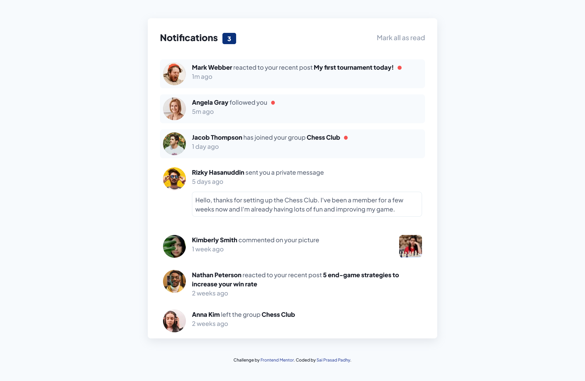
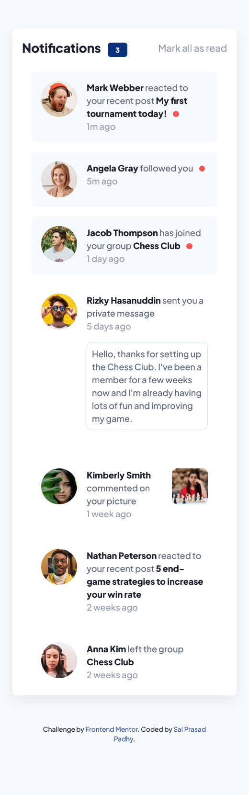

# Frontend Mentor - Notifications page solution

This is a solution to the [Notifications page challenge on Frontend Mentor](https://www.frontendmentor.io/challenges/notifications-page-DqK5QAmKbC). Frontend Mentor challenges help you improve your coding skills by building realistic projects. 

## Table of contents

- [Overview](#overview)
  - [The challenge](#the-challenge)
  - [Screenshot](#screenshot)
      - [Desktop/Laptop](#desktop-view)
      - [Mobile](#mobile-view)
  - [Links](#links)
- [My process](#my-process)
  - [Built with](#built-with)
  - [What I learned](#what-i-learned)
- [Author](#author)
- [Acknowledgments](#acknowledgments)

## Overview

### The challenge

Users should be able to:

- View the optimal layout for the site depending on their device's screen size
- See hover states for all interactive elements on the page

### Screenshot

#### Desktop view

#### Mobile View

### Links

- Solution URL: [Github Repo](https://github.com/Padhysai/notifications-page-main)
- Live Site URL: [https://projects.saiprasadpadhy.in/huddle-landing-page](https://projects.saiprasadpadhy.in/notifications-page-main)

## My process

### Built with

- Semantic HTML5 markup
- Flexbox
- Mobile-first workflow
- CSS Variables
- CSS Positions

### What I learned

I have learnt about tailwind configuration and CSS Positions and how to use variables to maintain consistency of site.

## Author

- Website - [Sai Prasad Padhy](https://projects.saiprasadpadhy.in/)
- Frontend Mentor - [@saiprasad006](https://blog.saiprasadpadhy.in/)
- Twitter - [@saiprasadpadhy](https://www.linkedin.com/in/saiprasadpadhy/)

## Acknowledgments

Thanks Frontendmentor.io for awesome challenges which boost our confidence.
